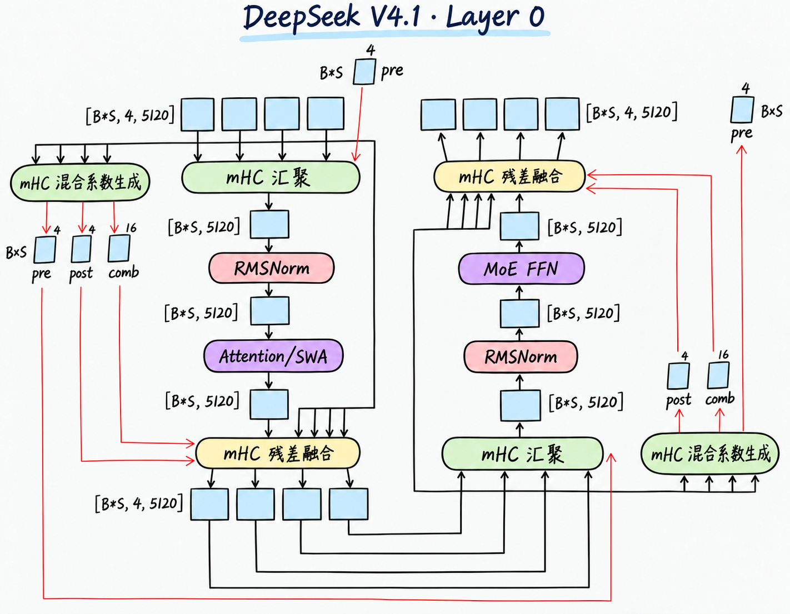
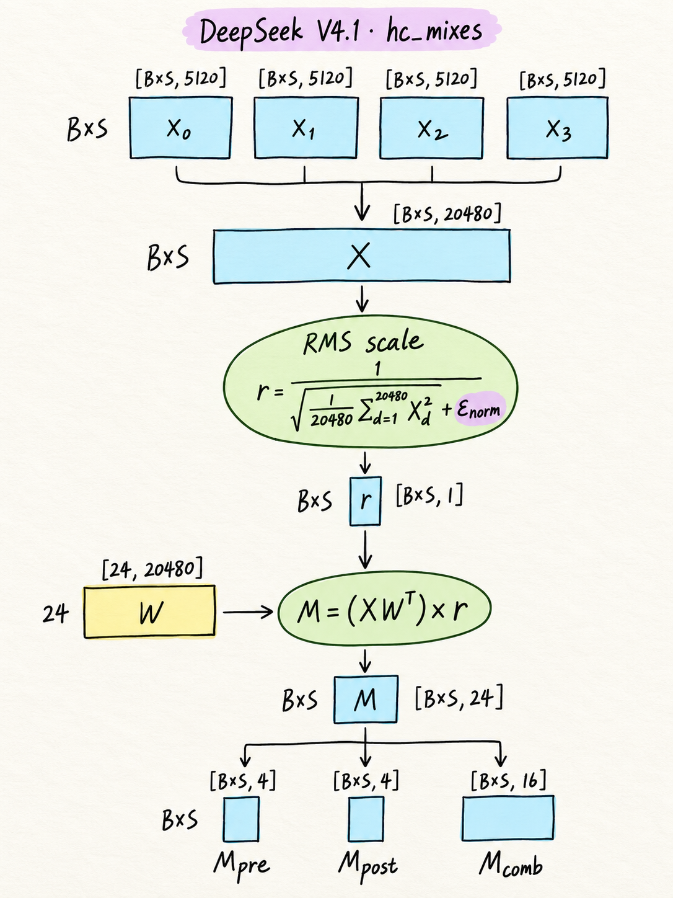
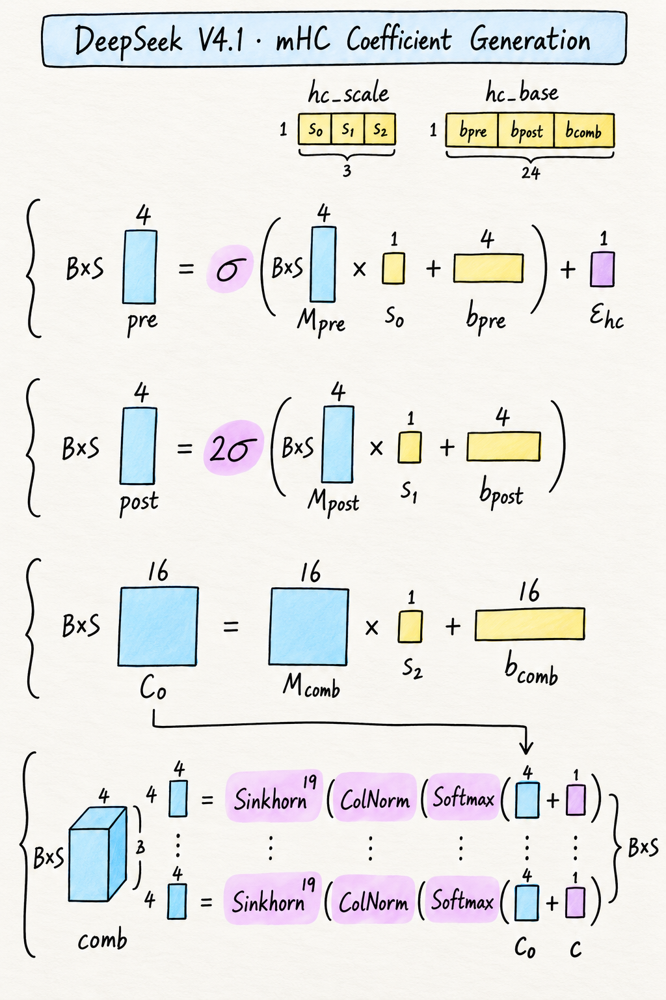
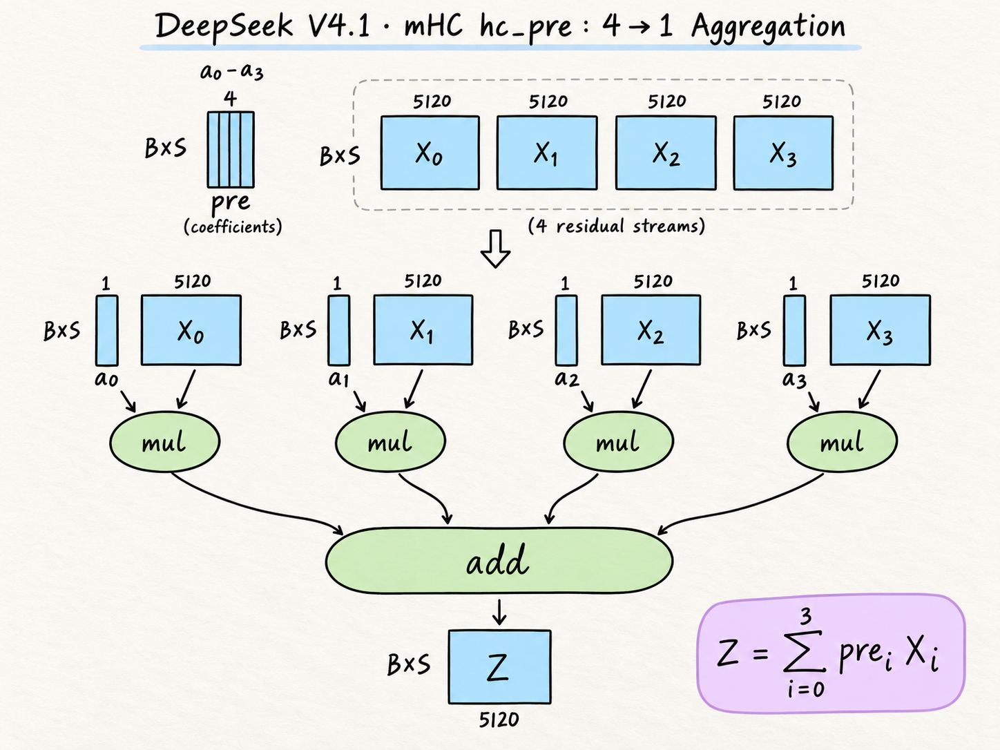
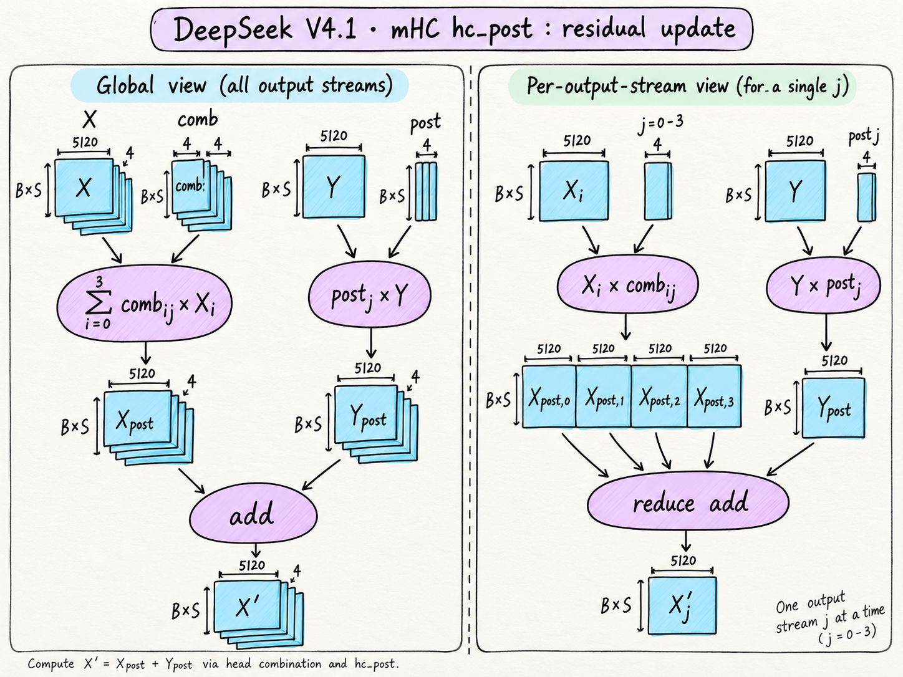

# Layer 0：从四路残差到局部注意力与 MoE

## 1. Layer 0 总览

Layer 0 由 Attention 和 MoE 两个串行子层组成，每个子层都通过 mHC 与四路残差连接：

- **入口汇聚**：四路残差汇成一路，同时由四路输入生成混合系数。
- **子层计算**：单路输入经过 RMSNorm，再执行 Attention 或 MoE。
- **出口融合**：子层输出与保留的原四路残差融合，恢复为四路，交给下一子层。

四路整体为 `[BxS,4,5120]`，汇聚后的单路为 `[BxS,5120]`。

混合系数生成分支读取各自子层的四路输入。生成的 **post、comb 用于当前出口，pre 用于下一子层入口**。Layer 0 初始四路来自同一份 embedding，首次 pre 为 `[1,0,0,0]`。

## 2. mHC

### 2.1 四路输入生成 raw mixes

四路输入经过展平、RMS 缩放与联合投影，生成混合系数的原始值：

- **展平**：$X_0$～$X_3$ 沿 hidden 维拼接，每个 token 的 $4\times5120$ 个元素组成 $X$ $[\mathrm{BxS},20480]$。

    $$
    X=[X_0\;X_1\;X_2\;X_3]
    $$

- **RMS 缩放**：对每行的 $20480$ 个元素计算一个缩放因子，得到 $r$ $[\mathrm{BxS},1]$；这里没有可学习的缩放权重。

    $$
    r_t=\left(\frac{1}{20480}\sum_{d=0}^{20479}X_{t,d}^{2}
    +\epsilon_{\mathrm{norm}}\right)^{-1/2},
    \qquad \epsilon_{\mathrm{norm}}=10^{-20}
    $$

- **联合投影**：$X$ 与权重 $W$ $[24,20480]$ 相乘，再按行乘 $r$，得到 $M$ $[\mathrm{BxS},24]$。

    $$
    M=(XW^{\mathsf T})\odot r
    $$

$M$ 按 **$4+4+16$** 拆成 $M_{\mathrm{pre}}$、$M_{\mathrm{post}}$、$M_{\mathrm{comb}}$，供下一步生成 $\mathrm{pre}$、$\mathrm{post}$、$\mathrm{comb}$；它们此时还是原始值。

$$
M=[M_{\mathrm{pre}}\;M_{\mathrm{post}}\;M_{\mathrm{comb}}]
$$

图中投影同时读取 **$X$ 和 $r$**，并不是只对 $r$ 做投影。

### 2.2 生成 pre、post、comb

三组 raw mixes 使用以下参数生成混合系数。$s$、$b$ 由训练学习，对所有 token 共用；固定常数由算法给定。

| 对象 | 来源与含义 |
|---|---|
| $s_0,s_1,s_2$ | $\mathrm{hc\_scale}:[3]$ 中的三个缩放标量，分别用于三个分支 |
| $b_{\mathrm{pre}},b_{\mathrm{post}},b_{\mathrm{comb}}$ | $\mathrm{hc\_base}:[24]$ 中的三组偏置，长度分别为 $4,4,16$ |
| $\epsilon_{\mathrm{hc}}=c=10^{-6}$ | 用于数值稳定的固定常数，不参与训练 |

$\sigma$ 为 Sigmoid：

$$
\sigma(x)=\frac{1}{1+e^{-x}}
$$

#### 生成 pre

输出 $\mathrm{pre}:[\mathrm{BxS},4]$：

$$
\mathrm{pre}=\sigma(M_{\mathrm{pre}}\cdot s_0+b_{\mathrm{pre}})+\epsilon_{\mathrm{hc}}
$$

#### 生成 post

输出 $\mathrm{post}:[\mathrm{BxS},4]$：

$$
\mathrm{post}=2\sigma(M_{\mathrm{post}}\cdot s_1+b_{\mathrm{post}})
$$

#### Sinkhorn

Sinkhorn 是行、列交替归一化的迭代方法，使正值矩阵的行和、列和接近 $1$。在残差混合中，行对应旧残差流，列对应新残差流，分别约束每路分配出去和接收进来的混合系数总量。

对每个 token 的 $4\times4$ 工作矩阵 $A$，行、列归一化分别为：

$$
\begin{aligned}
\operatorname{RowNorm}(A)_{ij}
&=\frac{A_{ij}}{\sum_{k=0}^{3}A_{ik}+c}\\
\operatorname{ColNorm}(A)_{ij}
&=\frac{A_{ij}}{\sum_{k=0}^{3}A_{kj}+c}
\end{aligned}
$$

其中，一次 Sinkhorn 迭代表示：

$$
\operatorname{Sinkhorn}(A)
=\operatorname{ColNorm}\left(\operatorname{RowNorm}(A)\right)
$$

#### 生成 comb

先得到 $C_0:[\mathrm{BxS},16]$：

$$
C_0=M_{\mathrm{comb}}\cdot s_2+b_{\mathrm{comb}}
$$

将 $C_0$ 重排为 $[\mathrm{BxS},4,4]$。每个 token 的矩阵先做行 Softmax、逐项加 $c$，再做首次列归一化；随后执行 $19$ 次 Sinkhorn 迭代：

$$
\mathrm{comb}=
\operatorname{Sinkhorn}^{19}
\left(
\operatorname{ColNorm}
\left(
\operatorname{Softmax}_{\mathrm{row}}(C_0)+c
\right)
\right)
$$

最终输出 $\mathrm{comb}:[\mathrm{BxS},4,4]$。

### 2.3 四路汇聚 hc_pre

四路残差分别乘以对应的 $\mathrm{pre}$ 系数，再相加，得到单路输入 $Z$。

| 对象 | 维度与含义 |
|---|---|
| $X_0,X_1,X_2,X_3$ | 各为 $[\mathrm{BxS},5120]$，表示四路残差 |
| $a_0,a_1,a_2,a_3$ | $\mathrm{pre}:[\mathrm{BxS},4]$ 的四列，各按 $[\mathrm{BxS},1]$ 使用 |
| $Z$ | $[\mathrm{BxS},5120]$，表示汇聚后的单路输入 |

$$
Z=a_0\odot X_0+a_1\odot X_1+a_2\odot X_2+a_3\odot X_3
$$

每个 token 的 $a_i$ 作用于对应残差流的全部 $5120$ 个元素；求和只沿四路进行，保留 token 与 hidden 维度。

本次使用的 $\mathrm{pre}$ 由上一子层生成；Layer 0 首次汇聚使用固定值 $[1,0,0,0]$。

### 2.4 残差融合 hc_post

左侧展示四路输出的整体融合，右侧展开单个输出流 $j$ 的计算，两侧表达的是同一个过程。

输入为保留的四路残差 $X:[\mathrm{BxS},4,5120]$ 和子层输出 $Y:[\mathrm{BxS},5120]$，使用当前子层生成的 $\mathrm{comb}:[\mathrm{BxS},4,4]$ 与 $\mathrm{post}:[\mathrm{BxS},4]$。

- **旧残差混合**：每个输出流 $j$ 都接收旧四路的加权结果。$\mathrm{comb}_{t,i,j}$ 表示 token $t$ 的旧第 $i$ 路到新第 $j$ 路的系数。

$$
X_{\mathrm{post},t,j,d}
=\sum_{i=0}^{3}\mathrm{comb}_{t,i,j}X_{t,i,d}
$$

- **子层输出写入**：同一个 $Y$ 按各路的 $\mathrm{post}$ 系数加权，每个系数作用于该 token 的全部 $5120$ 个元素。

$$
Y_{\mathrm{post},t,j,d}
=\mathrm{post}_{t,j}Y_{t,d}
$$

两条分支逐元素相加，恢复为四路：

$$
X'=X_{\mathrm{post}}+Y_{\mathrm{post}},
\qquad X':[\mathrm{BxS},4,5120]
$$

其中，$t$ 表示 token，$i$、$j$ 分别表示旧、新残差流，$d$ 表示 hidden 元素。

### 2.5 参数量、计算量与空间占用

#### 参数量

一套 mHC 的可学习参数包括联合投影矩阵 $W$、偏置 $\mathrm{hc\_base}$ 和缩放系数 $\mathrm{hc\_scale}$。参数量中的 K、M 分别表示 $10^3$、$10^6$ 个参数。

| 参数 | 维度 | 参数量 |
|---|---|---:|
| $W$ | $24\times20480$ | 491,520 |
| $\mathrm{hc\_base}$ | $24$ | 24 |
| $\mathrm{hc\_scale}$ | $3$ | 3 |
| **合计** | — | **491,547** |

$$
P_{\mathrm{mHC}}
=24\times20480+24+3
=491547
$$

Layer 0 的 Attention、MoE 各有独立的一套 mHC，合计 **983094（983.094K）** 个参数。四路汇聚和残差融合不引入额外可学习参数，固定常数不计入参数量。

#### 计算量

只统计 mHC 的前向计算。加法、减法和乘法每次计 1 次，其他运算分别统计。

下表为**一套 mHC 处理一个 token** 的计算量。

| 阶段 | 计算公式 | 乘加运算量 | 其他运算量 |
|---|---|---:|---|
| RMS 缩放因子 $r$ | $r_t=\left(\frac{1}{20480}\sum_d X_{t,d}^2+\epsilon_{\mathrm{norm}}\right)^{-1/2}$ | $20480+20479+2=40961$ | rsqrt：1 次 |
| 联合投影 | $\widetilde M=XW^{\mathsf T}$ | $24\times(20480+20479)=983016$ | — |
| 投影结果缩放及偏置 | $M=\widetilde M\odot r$ $s_0M_{\mathrm{pre}}+b_{\mathrm{pre}}$ $s_1M_{\mathrm{post}}+b_{\mathrm{post}}$ $s_2M_{\mathrm{comb}}+b_{\mathrm{comb}}$ | $24\times3=72$ | — |
| pre、post 的 Sigmoid | $\sigma(x)=\frac{1}{1+\exp(-x)}$ | $8\times2=16$ | exp：8 次 除法：8 次 |
| pre 加 $\epsilon_{\mathrm{hc}}$、post 乘 $2$ | $\mathrm{pre}=\sigma(\cdot)+\epsilon_{\mathrm{hc}}$ $\mathrm{post}=2\sigma(\cdot)$ | $4+4=8$ | — |
| comb：行 Softmax 后加 $c$ | $A=\operatorname{Softmax}_{\mathrm{row}}(C_0)+c$ | $4\times(4+3+4)=44$ | 比较：12 次 exp：16 次 除法：16 次 |
| comb：行列归一化，含首次列归一化 | $\mathrm{comb}=\operatorname{Sinkhorn}^{19}\!\left(\operatorname{ColNorm}(A)\right)$ | $39\times(12+4)=624$ | 除法：$39\times16=624$ 次 |
| 四路汇聚 $\mathrm{hc\_pre}$ | $Z=\sum_{i=0}^{3}a_i\odot X_i$ | $5120\times(4+3)=35840$ | — |
| 残差融合 $\mathrm{hc\_post}$ | $X'_j=\sum_{i=0}^{3}\mathrm{comb}_{ij}\odot X_i+\mathrm{post}_j\odot Y$ | $4\times5120\times(4+3+1+1)=184320$ | — |
| **合计** | — | **1,244,901** | 除法：648 次 exp：24 次 rsqrt：1 次 比较：12 次 |

每层包含 Attention、MoE 两套 mHC。Layer 0 的首次汇聚直接取第 0 路输入，省去 $35840$ 次乘加运算。下表为**每层 mHC 处理一个 token** 的计算量。

| op | 普通层计算量 | Layer 0 计算量 |
|---|---:|---:|
| 乘加运算 | 2.490M | 2.454M |
| 除法 | 1.296K | 1.296K |
| exp | 48 | 48 |
| rsqrt | 2 | 2 |
| 比较 | 24 | 24 |

计算量表中的 K、M 分别表示 $10^3$、$10^6$ 次运算。处理 $\mathrm{BxS}$ 个 token 时，各项计算量按 $\mathrm{BxS}$ 倍计。

#### 空间占用

记 $\mathrm{BxS}=B\times S$。以下分析**一套 mHC** 的前向空间占用。

分析口径：将整个 mHC 作为一个逻辑分析单元，参数和输入、输出计入 Global Memory；内部中间量（包括 $Z$、$Y$）假设可在 Shared Memory / Register 中保存和消化，不完整物化到 Global Memory。输入、输出分别计数，不考虑 mHC 与相邻模块之间的进一步融合。

##### Tensor 细节表

| Tensor | 分类 | Shape | dtype | Logical Size（Byte） | Liveness |
|---|---|---|---|---:|---|
| $W$ | Weight | $[24,20480]$ | FP32 | $1966080$ | 模型加载 → 模型卸载 |
| $\mathrm{hc\_scale}$ | Weight | $[3]$ | FP32 | $12$ | 模型加载 → 模型卸载 |
| $\mathrm{hc\_base}$ | Weight | $[24]$ | FP32 | $96$ | 模型加载 → 模型卸载 |
| $X$ | I/O：Input | $[\mathrm{BxS},4,5120]$ | BF16 | $40960\mathrm{BxS}$ | mHC 输入 → 当前 mHC 完成 |
| $\mathrm{pre}_{\mathrm{in}}$ | I/O：Input | $[\mathrm{BxS},4]$ | FP32 | $16\mathrm{BxS}$ | 上一子层传入 → 当前 $\mathrm{hc\_pre}$ 完成 |
| $X_{\mathrm{fp32}}$ | Internal Activation | $[\mathrm{BxS},20480]$ | FP32 | $81920\mathrm{BxS}$ | 类型转换 / 归一化 / 投影阶段 |
| $r$ | Internal Activation | $[\mathrm{BxS},1]$ | FP32 | $4\mathrm{BxS}$ | 归一化 → 投影 |
| $M$ | Internal Activation | $[\mathrm{BxS},24]$ | FP32 | $96\mathrm{BxS}$ | 系数投影 → pre/post/comb 生成 |
| $\mathrm{pre}_{\mathrm{out}}$ | I/O：Output | $[\mathrm{BxS},4]$ | FP32 | $16\mathrm{BxS}$ | 当前系数生成 → 下一子层 $\mathrm{hc\_pre}$ 完成 |
| $\mathrm{post}$ | Internal Activation | $[\mathrm{BxS},4]$ | FP32 | $16\mathrm{BxS}$ | 系数生成 → 当前 $\mathrm{hc\_post}$ |
| $\mathrm{comb}$ | Internal Activation | $[\mathrm{BxS},4,4]$ | FP32 | $64\mathrm{BxS}$ | 系数生成 → 当前 $\mathrm{hc\_post}$ |
| $Z$ | Internal Activation | $[\mathrm{BxS},5120]$ | BF16 | $10240\mathrm{BxS}$ | $\mathrm{hc\_pre}$ 输出 → 子层计算 |
| $Y$ | Internal Activation | $[\mathrm{BxS},5120]$ | BF16 | $10240\mathrm{BxS}$ | 子层输出 → $\mathrm{hc\_post}$ |
| $X'$ | I/O：Output | $[\mathrm{BxS},4,5120]$ | BF16 | $40960\mathrm{BxS}$ | mHC 输出 → 下一逻辑模块 |

分类口径：

- **Weight**：模型固有参数，需要长期保存。
- **I/O**：当前逻辑单元边界上的完整输入、输出；$\mathrm{pre}_{\mathrm{in}}$ 来自上一子层，$\mathrm{pre}_{\mathrm{out}}$ 传给下一子层。
- **Internal Activation**：逻辑上存在，按本文假设不完整物化到 Global Memory。

##### Global Memory 汇总表

空间占用使用二进制单位：$1\,\mathrm{KiB}=1024\,\mathrm{Byte}$，$1\,\mathrm{MiB}=1024^2\,\mathrm{Byte}$。

| 类别 | 包含 Tensor | Global Memory Size |
|---|---|---:|
| Parameter | $W,\ \mathrm{hc\_scale},\ \mathrm{hc\_base}$ | $\approx1.88\,\mathrm{MiB}$ |
| Input | $X,\ \mathrm{pre}_{\mathrm{in}}$ | $40\,\mathrm{KiB}\cdot \mathrm{BxS}+16\mathrm{BxS}\,\mathrm{Byte}$ |
| Output | $X',\ \mathrm{pre}_{\mathrm{out}}$ | $40\,\mathrm{KiB}\cdot \mathrm{BxS}+16\mathrm{BxS}\,\mathrm{Byte}$ |
| **Required Global Memory** | Parameter + Input + Output | **$\approx1.88\,\mathrm{MiB}+80\,\mathrm{KiB}\cdot \mathrm{BxS}+32\mathrm{BxS}\,\mathrm{Byte}$** |

Internal Activation：

$$
X_{\mathrm{fp32}},\ r,\ M,\ \mathrm{post},\ \mathrm{comb},\ Z,\ Y
$$

以上中间量不计入本节 Required Global Memory；这是本文理想化分析口径。

##### 空间公式

$$
\boxed{
M_{\mathrm{mHC}}(B,S)
\approx
1.88\,\mathrm{MiB}+80\,\mathrm{KiB}\cdot \mathrm{BxS}+32\mathrm{BxS}\,\mathrm{Byte}
}
$$

其中：

$$
M_{\mathrm{param}}\approx1.88\,\mathrm{MiB}
$$

$$
M_{\mathrm{input}}=40\,\mathrm{KiB}\cdot \mathrm{BxS}+16\mathrm{BxS}\,\mathrm{Byte}
$$

$$
M_{\mathrm{output}}=40\,\mathrm{KiB}\cdot \mathrm{BxS}+16\mathrm{BxS}\,\mathrm{Byte}
$$

形状与类型依据：[模型配置](https://huggingface.co/deepseek-ai/DeepSeek-V4.1-Flash/raw/main/inference/config.json)、[模型前向实现](https://huggingface.co/deepseek-ai/DeepSeek-V4.1-Flash/raw/main/inference/model.py)、[系数生成核](https://huggingface.co/deepseek-ai/DeepSeek-V4.1-Flash/raw/main/inference/kernel.py)。核查日期：2026-10-05。

## 3. 两个入口 RMSNorm

RMSNorm 对单路输入的每个 token 独立计算：

$$
U_{t,d}=\gamma_d Z_{t,d}\left(\frac{1}{5120}\sum_{k=0}^{5119}Z_{t,k}^2+10^{-20}\right)^{-1/2}
$$

输入输出都是 `[BxS,5120]`。$\gamma:[5120]$ 可学习，没有加法偏置；不减均值。Attention 与 MoE 的入口各有一套，合计 **10,240** 个权重。这里与 mHC 的 RMS 因子不同：mHC 统计的是四路展平后的 20480 维，且没有独立 gamma。[核查：`RMSNorm`](https://huggingface.co/deepseek-ai/DeepSeek-V4.1-Flash/raw/main/inference/model.py)

## 4. 局部 Attention / SWA

### 4.1 从单路输入生成 Q 与共享 KV

以下 $U:[\mathrm{BxS},5120]$ 已经过 Attention 入口 RMSNorm。Q 与 KV 两条支路读取同一个 U：

| 步骤 | 权重 / 操作 | 输出 shape |
|---|---|---|
| Q 降维 | $W_{Qa}:[1280,5120]$ | `[BxS,1280]` |
| Q 归一化 | 独立 RMSNorm，gamma 为 `[1280]` | `[BxS,1280]` |
| Q 展开 | $W_{Qb}:[32768,1280]$，分成 64 头 | `[BxS,64,512]` |
| KV 投影 | $W_{KV}:[512,5120]$ | `[BxS,512]` |
| KV 归一化 | 独立 RMSNorm，gamma 为 `[512]` | `[BxS,512]` |
| 位置编码 | Q 每头、KV 的最后 64 维做 RoPE | shape 不变 |

64 个 Query 头共用同一份表示 $C=K=V:[B,S,512]$。其余 448 维不旋转。第 0 层的局部支路采用基数 10000 的 RoPE。这里不展开 KV 量化与存储布局。[核查：`Attention`](https://huggingface.co/deepseek-ai/DeepSeek-V4.1-Flash/raw/main/inference/model.py)

### 4.2 完整打分、mask、归一化、加权汇总

`S_his` 表示参与本次评分的 KV 序列总长度，包括本次已加入 KV 的 token；它不是局部缓存的物理容量。以完整序列 $S_{\mathrm{his}}=S$ 为例，数学上保留每个 Query 对本会话全部 S 个位置的分数；batch 之间不互相打分。固定会话 b 和头 h：

$$
E_{b,h}=Q_{b,h}C_b^T/\sqrt{512},\qquad L_{b,h}=E_{b,h}+M_b
$$

$$
M_{b,i,j}=\begin{cases}0,&0\le p_{b,i}-p_{b,j}<128\\-\infty,&\text{其他}\end{cases}
$$

窗口是**主对角线及以下 127 条对角线**，不是完整下三角。带每头 sink 标量 $a_h$ 的权重与汇总为：

$$
P_{b,h,i,j}=\frac{\exp(L_{b,h,i,j})}{\exp(a_h)+\sum_{k=0}^{S-1}\exp(L_{b,h,i,k})},\qquad
O_{b,h}=P_{b,h}C_b
$$

| 对象 | 展平 token 后的 shape |
|---|---|
| Q | `[BxS,64,512]` |
| C=K=V | `[B,S,512]` |
| E、L、P | `[BxS,64,S]` |
| mask | `[B,S,S]`，沿头维广播 |
| O | `[BxS,64,512]` |

sink 只占用归一化分母，不提供内容；真实 token 的权重和不必为 1。最后一步按 `[S,512]` 的 C 排列写 **PC，不是 PCᵀ**。处理历史前缀时，完整数学分数最后一维改为 `S_his`，而不是提前截成窗口 128。[核查：`sparse_attn`](https://huggingface.co/deepseek-ai/DeepSeek-V4.1-Flash/raw/main/inference/kernel.py)

### 4.3 输出恢复与两级分组投影

对 O 每头最后 64 维按当前 Query 位置做逆 RoPE，随后：

$$
[\mathrm{BxS},64,512]\to[\mathrm{BxS},8,4096]\to[\mathrm{BxS},8,1024]\to[\mathrm{BxS},8192]\to[\mathrm{BxS},5120]
$$

每组 8 个头；第一组权重整体为 `[8,1024,4096]`，各组独立。第二级权重为 `[5120,8192]`，合并各组信息。两级之间没有额外非线性。这得到 Attention 的单路输出 Y，再交给 mHC 融合。

以上描述数学对象，不表示实现会分配完整分数矩阵。

## 5. MoE 前馈计算

### 5.1 选择 6 个路由专家

MoE 输入 $U:[\mathrm{BxS},5120]$。路由投影权重 $W_R:[384,5120]$，本配置温度为 1：

$$
R=\sqrt{\operatorname{Softplus}(UW_R^T)},\qquad I_t=\operatorname{TopKIndices}_{6}(R_t+b)
$$

$R:[\mathrm{BxS},384]$，$I:[\mathrm{BxS},6]$。修正量 $b:[384]$ 只改变选中哪些专家，融合权重仍取原始正数评分：

$$
g_{t,k}=1.5\frac{R_{t,I_{t,k}}}{\sum_{\ell=0}^{5}R_{t,I_{t,\ell}}+10^{-20}}
$$

$g:[\mathrm{BxS},6]$，各 token 的权重和约为 1.5。图像 token 使用另一个修正向量 `bias_vl`；本文的文本路径使用 `bias`。[核查：`Gate`](https://huggingface.co/deepseek-ai/DeepSeek-V4.1-Flash/raw/main/inference/model.py)

### 5.2 每个专家的带截断 SwiGLU

每个专家有独立的 $W_1,W_3:[2304,5120]$ 与 $W_2:[5120,2304]$，没有投影偏置：

$$
F_e(U)=\left[\operatorname{SiLU}(\min(UW_{1,e}^T,10))\odot\operatorname{clip}(UW_{3,e}^T,-10,10)\right]W_{2,e}^T
$$

两条支路分别产生 `[BxS,2304]`；逐元素相乘后再投影回 `[BxS,5120]`。Gate 支路只截断上界，Up 支路同时截断上下界。[核查：`Expert`](https://huggingface.co/deepseek-ai/DeepSeek-V4.1-Flash/raw/main/inference/model.py)

### 5.3 合并路由专家与共享专家

$$
Y_t=\sum_{k=0}^{5}g_{t,k}F_{I_{t,k}}(U_t)+F_{\mathrm{shared}}(U_t)
$$

每个 token 的 6 个路由专家输出可记作 `[BxS,6,5120]`，沿 6 求和得到 `[BxS,5120]`，再加共享专家。共享专家不参加 Top-K，不乘路由权重。这里不再加输入 U：残差在外部 mHC 完成。[核查：`MoE`](https://huggingface.co/deepseek-ai/DeepSeek-V4.1-Flash/raw/main/inference/model.py)

这里定义数学函数，不表示实际对每个 token 计算全部 384 个专家。

## 6. 本层参数与状态汇总

下表按前述逻辑维度求积，不含 embedding、输出头、量化 scale 和运行时系数，也不把 KV cache 算成参数：

| 部分 | 逻辑参数量 |
|---|---:|
| Attention 侧 mHC 系数生成 | 491,547 |
| MoE 侧 mHC 系数生成 | 491,547 |
| 两个入口 RMSNorm | 10,240 |
| SWA（投影、内部 Norm 与 64 个 sink） | 126,617,408 |
| MoE（384＋1 个专家、路由投影、两套修正量） | 13,626,901,248 |
| **Layer 0 合计** | **13,754,511,990** |

推导检查：单专家参数为 $3\times5120\times2304=35,389,440$；MoE 为 $385\times35,389,440+384\times5120+2\times384$。每 token 只激活 6 个路由专家和共享专家，不能用总参数量直接代替当次计算量。

本层对后续层输出四路残差 `[BxS,4,5120]`，以及给下一层 Attention 的 `pre_next:[BxS,4]`；它自己的局部 KV 状态逻辑容量为 `[B,128,512]`。没有独立的全局缓存。容量按量化字节数的计算放到成本分析篇。

## 7. 资料来源与版本说明

本文分析对象为 **DeepSeek-V4.1-Flash**，数学关系与维度依据以下上游资料：

- [模型配置](https://huggingface.co/deepseek-ai/DeepSeek-V4.1-Flash/raw/main/inference/config.json)
- [模型前向实现](https://huggingface.co/deepseek-ai/DeepSeek-V4.1-Flash/raw/main/inference/model.py)：RMSNorm、Attention、Gate、Expert、MoE、Block。
- [算子数学细节](https://huggingface.co/deepseek-ai/DeepSeek-V4.1-Flash/raw/main/inference/kernel.py)：hc_split_sinkhorn、sparse_attn。

当前引用使用上游 `main` 链接，尚未锁定固定 revision；上游后续更新可能与本文分析时的内容不同。本轮文字核查集中于概述与 mHC，不构成对 SWA、MoE 全部细节的重新验证。图示的维度与公式以相邻正文为准。
