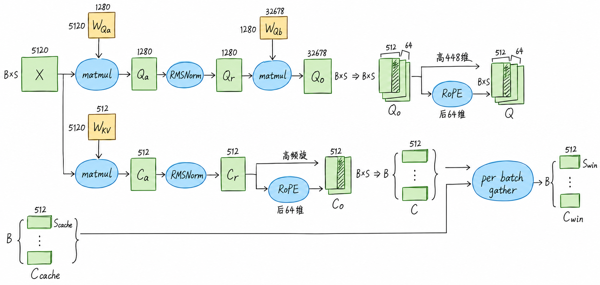
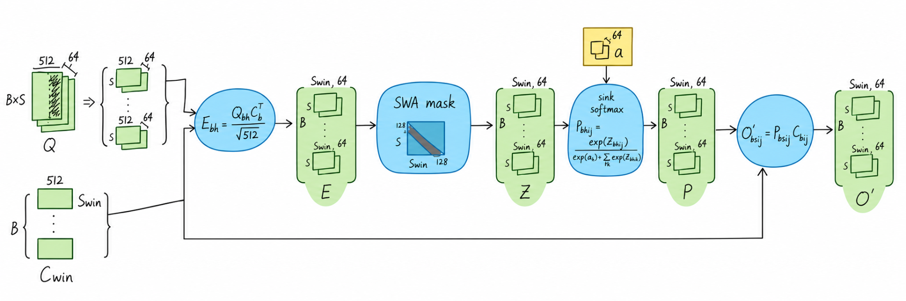
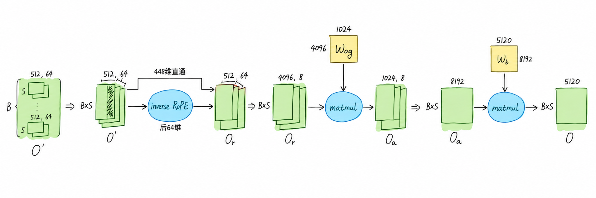

# Layer 0：从四路残差到局部注意力与 MoE

## 1. Layer 0 总览

本文分析 **DeepSeek-V4.1-Flash 的 Layer 0 文本前向路径**，张量形状按完整逻辑维度表示。

$B$ 表示 batch，$S$ 表示本次处理的 token 数，$\mathrm{BxS}=B\times S$ 表示合并后的 token 维。Attention 仍按各自会话计算。

Layer 0 先计算 Attention，再计算 MoE；两个子层各有独立的一套 mHC。初始四路来自同一份 embedding，整体形状为 `[BxS,4,5120]`，首次 pre 为 `[1,0,0,0]`。

每个子层的流程为：

- **入口汇聚**：四路残差汇成一路，同时由四路输入生成混合系数。
- **子层计算**：单路输入 `[BxS,5120]` 经过 RMSNorm，再执行 Attention 或 MoE。
- **出口融合**：子层输出与保留的原四路残差融合，恢复为 `[BxS,4,5120]`，交给下一子层。

混合系数生成分支读取当前子层的四路输入。生成的 **post、comb 用于当前出口，pre 用于下一子层入口**：Attention 侧的 pre 交给本层 MoE，MoE 侧的 pre 交给下一层 Attention。

## 2. mHC

### 2.1 四路输入生成 raw mixes

四路输入经过展平、RMS 缩放与联合投影，生成混合系数的原始值。以下 $t$ 为展平后的 token 索引，$d$ 为特征元素索引，$\odot$ 表示逐元素相乘；线性权重按 `[输出,输入]` 排列。

计算分为三步：

- **展平**：$X_0$～$X_3$ 沿 hidden 维拼接，每个 token 的 $4\times5120$ 个元素组成 $X$ $[\mathrm{BxS},20480]$。

    $$
    X=[X_0\;X_1\;X_2\;X_3]
    $$

- **RMS 缩放**：对每行的 $20480$ 个元素计算一个缩放因子，得到 $r$ $[\mathrm{BxS},1]$；这里没有可学习的缩放权重。

    $$
    r_t=\left(\frac{1}{20480}\sum_{d=0}^{20479}X_{t,d}^{2}
    +\epsilon_{\mathrm{norm}}\right)^{-1/2},
    \qquad \epsilon_{\mathrm{norm}}=10^{-20}
    $$

- **联合投影**：$X$ 与权重 $W$ $[24,20480]$ 相乘，再按行乘 $r$，得到 $M$ $[\mathrm{BxS},24]$。

    $$
    M=(XW^{\mathsf T})\odot r
    $$

$M$ 按 **$4+4+16$** 拆成 $M_{\mathrm{pre}}$、$M_{\mathrm{post}}$、$M_{\mathrm{comb}}$，供下一步生成 $\mathrm{pre}$、$\mathrm{post}$、$\mathrm{comb}$；它们此时还是原始值。

$$
M=[M_{\mathrm{pre}}\;M_{\mathrm{post}}\;M_{\mathrm{comb}}]
$$

$X$ 提供投影内容，$r$ 按行广播，对投影结果逐行缩放。

### 2.2 生成 pre、post、comb

$M$ 以及由它生成的 pre、post、comb 都是随输入变化的动态值。下面的 $s$、$b$ 是训练得到的模型参数，对所有 token 共用；固定常数由算法给定。

| 对象 | 来源与含义 |
|---|---|
| $s_0,s_1,s_2$ | $\mathrm{hc\_scale}:[3]$ 中的三个缩放标量，分别用于三个分支 |
| $b_{\mathrm{pre}},b_{\mathrm{post}},b_{\mathrm{comb}}$ | $\mathrm{hc\_base}:[24]$ 中的三组偏置，长度分别为 $4,4,16$ |
| $\epsilon_{\mathrm{hc}}=c=10^{-6}$ | 用于数值稳定的固定常数，不参与训练 |

$\sigma$ 为 Sigmoid：

$$
\sigma(x)=\frac{1}{1+e^{-x}}
$$

#### 生成 pre

输出 $\mathrm{pre}:[\mathrm{BxS},4]$：

$$
\mathrm{pre}=\sigma(M_{\mathrm{pre}}\cdot s_0+b_{\mathrm{pre}})+\epsilon_{\mathrm{hc}}
$$

#### 生成 post

输出 $\mathrm{post}:[\mathrm{BxS},4]$：

$$
\mathrm{post}=2\sigma(M_{\mathrm{post}}\cdot s_1+b_{\mathrm{post}})
$$

#### Sinkhorn

Sinkhorn 是行、列交替归一化的迭代方法，使正值矩阵的行和、列和接近 $1$。在残差混合中，行对应旧残差流，列对应新残差流，分别约束每路分配出去和接收进来的混合系数总量。

对每个 token 的 $4\times4$ 工作矩阵 $A$，行、列归一化分别为：

$$
\begin{aligned}
\operatorname{RowNorm}(A)_{ij}
&=\frac{A_{ij}}{\sum_{k=0}^{3}A_{ik}+c}\\
\operatorname{ColNorm}(A)_{ij}
&=\frac{A_{ij}}{\sum_{k=0}^{3}A_{kj}+c}
\end{aligned}
$$

其中，一次 Sinkhorn 迭代表示：

$$
\operatorname{Sinkhorn}(A)
=\operatorname{ColNorm}\left(\operatorname{RowNorm}(A)\right)
$$

#### 生成 comb

先得到 $C_0:[\mathrm{BxS},16]$：

$$
C_0=M_{\mathrm{comb}}\cdot s_2+b_{\mathrm{comb}}
$$

将 $C_0$ 重排为 $[\mathrm{BxS},4,4]$。本配置 $\mathrm{hc\_sinkhorn\_iters}=20$：先做行 Softmax、逐项加 $c$ 和首次列归一化，再执行 $19$ 次 Sinkhorn 迭代，共完成 $20$ 次列归一化：

$$
\mathrm{comb}=
\operatorname{Sinkhorn}^{19}
\left(
\operatorname{ColNorm}
\left(
\operatorname{Softmax}_{\mathrm{row}}(C_0)+c
\right)
\right)
$$

最终输出 $\mathrm{comb}:[\mathrm{BxS},4,4]$。

### 2.3 四路汇聚 hc_pre

本次使用的 $\mathrm{pre}$ 由上一子层生成；Layer 0 首次汇聚使用固定值 $[1,0,0,0]$。四路残差分别乘以对应系数，再相加，得到单路输入 $Z$。

| 对象 | 维度与含义 |
|---|---|
| $X_0,X_1,X_2,X_3$ | 各为 $[\mathrm{BxS},5120]$，表示四路残差 |
| $a_0,a_1,a_2,a_3$ | $\mathrm{pre}:[\mathrm{BxS},4]$ 的四列，各按 $[\mathrm{BxS},1]$ 使用 |
| $Z$ | $[\mathrm{BxS},5120]$，表示汇聚后的单路输入 |

$$
Z=a_0\odot X_0+a_1\odot X_1+a_2\odot X_2+a_3\odot X_3
$$

每个 token 的 $a_i$ 作用于对应残差流的全部 $5120$ 个元素；求和只沿四路进行，保留 token 与 hidden 维度。

### 2.4 残差融合 hc_post

左侧展示四路输出的整体融合，右侧展开单个输出流 $j$ 的计算，两侧表达的是同一个过程。

输入为保留的四路残差 $X:[\mathrm{BxS},4,5120]$ 和子层输出 $Y:[\mathrm{BxS},5120]$，使用当前子层生成的 $\mathrm{comb}:[\mathrm{BxS},4,4]$ 与 $\mathrm{post}:[\mathrm{BxS},4]$。以下 $i$、$j$ 分别表示旧、新残差流；$t$、$d$ 分别表示 token 与特征元素。

- **旧残差混合**：每个输出流 $j$ 都接收旧四路的加权结果。$\mathrm{comb}_{t,i,j}$ 表示 token $t$ 的旧第 $i$ 路到新第 $j$ 路的系数。

$$
X_{\mathrm{post},t,j,d}
=\sum_{i=0}^{3}\mathrm{comb}_{t,i,j}X_{t,i,d}
$$

- **子层输出写入**：同一个 $Y$ 按各路的 $\mathrm{post}$ 系数加权，每个系数作用于该 token 的全部 $5120$ 个元素。

$$
Y_{\mathrm{post},t,j,d}
=\mathrm{post}_{t,j}Y_{t,d}
$$

两条分支逐元素相加，恢复为四路：

$$
X'=X_{\mathrm{post}}+Y_{\mathrm{post}},
\qquad X':[\mathrm{BxS},4,5120]
$$

### 2.5 参数量、计算量与空间占用

以下先按**一套 mHC**统计，再按 Attention、MoE 两套汇总参数量和计算量。参数量、计算量中的 K、M 分别表示 $10^3$、$10^6$；空间占用使用 Byte、KiB、MiB。

#### 参数量

一套 mHC 的可学习参数包括联合投影矩阵 $W$、偏置 $\mathrm{hc\_base}$ 和缩放系数 $\mathrm{hc\_scale}$。四路汇聚和残差融合没有额外可学习参数，固定常数不计入参数量。

| 参数 | 维度 | 参数量 |
|---|---|---:|
| $W$ | $24\times20480$ | 491,520 |
| $\mathrm{hc\_base}$ | $24$ | 24 |
| $\mathrm{hc\_scale}$ | $3$ | 3 |
| **合计** | — | **491,547** |

$$
P_{\mathrm{mHC}}
=24\times20480+24+3
=491547
$$

Layer 0 的两套 mHC 合计 **983094（983.094K）** 个参数。

#### 计算量

仅统计 mHC 的前向算术运算，不含 Attention、MoE 本体，也不统计数据搬运和类型转换。

乘加列合计加法、减法和乘法，每次计 1 次；RMS 均值按乘以 $1/20480$ 计 1 次乘法。除法、exp、rsqrt、比较分别计数。下表为**一套 mHC 处理一个 token** 的计算量。

| 阶段 | 计算公式 | 乘加运算量 | 其他运算量 |
|---|---|---:|---|
| RMS 缩放因子 $r$ | $r_t=\left(\frac{1}{20480}\sum_d X_{t,d}^2+\epsilon_{\mathrm{norm}}\right)^{-1/2}$ | $20480+20479+2=40961$ | rsqrt：1 次 |
| 联合投影 | $\widetilde M=XW^{\mathsf T}$ | $24\times(20480+20479)=983016$ | — |
| 投影结果缩放及偏置 | $M=\widetilde M\odot r$ $s_0M_{\mathrm{pre}}+b_{\mathrm{pre}}$ $s_1M_{\mathrm{post}}+b_{\mathrm{post}}$ $s_2M_{\mathrm{comb}}+b_{\mathrm{comb}}$ | $24\times3=72$ | — |
| pre、post 的 Sigmoid | $\sigma(x)=\frac{1}{1+\exp(-x)}$ | $8\times2=16$ | exp：8 次 除法：8 次 |
| pre 加 $\epsilon_{\mathrm{hc}}$、post 乘 $2$ | $\mathrm{pre}=\sigma(\cdot)+\epsilon_{\mathrm{hc}}$ $\mathrm{post}=2\sigma(\cdot)$ | $4+4=8$ | — |
| comb：行 Softmax 后加 $c$ | $A=\operatorname{Softmax}_{\mathrm{row}}(C_0)+c$ | $4\times(4+3+4)=44$ | 比较：12 次 exp：16 次 除法：16 次 |
| comb：行列归一化，含首次列归一化 | $\mathrm{comb}=\operatorname{Sinkhorn}^{19}\!\left(\operatorname{ColNorm}(A)\right)$ | $39\times(12+4)=624$ | 除法：$39\times16=624$ 次 |
| 四路汇聚 $\mathrm{hc\_pre}$ | $Z=\sum_{i=0}^{3}a_i\odot X_i$ | $5120\times(4+3)=35840$ | — |
| 残差融合 $\mathrm{hc\_post}$ | $X'_j=\sum_{i=0}^{3}\mathrm{comb}_{ij}\odot X_i+\mathrm{post}_j\odot Y$ | $4\times5120\times(4+3+1+1)=184320$ | — |
| **合计** | — | **1,244,901** | 除法：648 次 exp：24 次 rsqrt：1 次 比较：12 次 |

将一套 mHC 的运算量乘以 $2$，得到**每层 mHC 处理一个 token**的计算量。Layer 0 的首次 pre 为 $[1,0,0,0]$；下表按理论上直接取第 $0$ 路输入计算，省去首次汇聚的 $35840$ 次乘加运算。

| op | 普通层计算量 | Layer 0 计算量 |
|---|---:|---:|
| 乘加运算 | 2.490M | 2.454M |
| 除法 | 1.296K | 1.296K |
| exp | 48 | 48 |
| rsqrt | 2 | 2 |
| 比较 | 24 | 24 |

处理 $\mathrm{BxS}$ 个 token 时，各项计算量按 $\mathrm{BxS}$ 倍计。

#### 空间占用

以下按**一套 mHC** 的完整逻辑张量核算理论 Global Memory 占用。数据类型见下表：FP32 每元素 $4$ Byte，BF16 每元素 $2$ Byte；$1\,\mathrm{KiB}=1024\,\mathrm{Byte}$，$1\,\mathrm{MiB}=1024^2\,\mathrm{Byte}$。

将整个 mHC 作为一个逻辑分析单元，采用以下存储假设：

- **Weight**：模型参数长期保存在 Global Memory。
- **I/O**：完整输入、输出保存在 Global Memory，并分别计数。$\mathrm{pre}_{\mathrm{in}}$ 从上一子层传入，$\mathrm{pre}_{\mathrm{out}}$ 传给下一子层；不考虑与相邻模块进一步融合或复用输入、输出存储。
- **Internal Activation**：所有内部中间量（包括 $Z$、$Y$）假设可在 Shared Memory / Register 中保存和消化，不完整物化到 Global Memory。

##### Tensor 细节表

| Tensor | 分类 | Shape | dtype | Logical Size（Byte） | Liveness |
|---|---|---|---|---:|---|
| $W$ | Weight | $[24,20480]$ | FP32 | $1966080$ | 模型加载 → 模型卸载 |
| $\mathrm{hc\_scale}$ | Weight | $[3]$ | FP32 | $12$ | 模型加载 → 模型卸载 |
| $\mathrm{hc\_base}$ | Weight | $[24]$ | FP32 | $96$ | 模型加载 → 模型卸载 |
| $X$ | I/O：Input | $[\mathrm{BxS},4,5120]$ | BF16 | $40960\mathrm{BxS}$ | mHC 输入 → 当前 mHC 完成 |
| $\mathrm{pre}_{\mathrm{in}}$ | I/O：Input | $[\mathrm{BxS},4]$ | FP32 | $16\mathrm{BxS}$ | 上一子层传入 → 当前 $\mathrm{hc\_pre}$ 完成 |
| $X_{\mathrm{fp32}}$ | Internal Activation | $[\mathrm{BxS},20480]$ | FP32 | $81920\mathrm{BxS}$ | 类型转换 / 归一化 / 投影阶段 |
| $r$ | Internal Activation | $[\mathrm{BxS},1]$ | FP32 | $4\mathrm{BxS}$ | 归一化 → 投影 |
| $M$ | Internal Activation | $[\mathrm{BxS},24]$ | FP32 | $96\mathrm{BxS}$ | 系数投影 → pre/post/comb 生成 |
| $\mathrm{pre}_{\mathrm{out}}$ | I/O：Output | $[\mathrm{BxS},4]$ | FP32 | $16\mathrm{BxS}$ | 当前系数生成 → 下一子层 $\mathrm{hc\_pre}$ 完成 |
| $\mathrm{post}$ | Internal Activation | $[\mathrm{BxS},4]$ | FP32 | $16\mathrm{BxS}$ | 系数生成 → 当前 $\mathrm{hc\_post}$ |
| $\mathrm{comb}$ | Internal Activation | $[\mathrm{BxS},4,4]$ | FP32 | $64\mathrm{BxS}$ | 系数生成 → 当前 $\mathrm{hc\_post}$ |
| $Z$ | Internal Activation | $[\mathrm{BxS},5120]$ | BF16 | $10240\mathrm{BxS}$ | $\mathrm{hc\_pre}$ 输出 → 子层计算 |
| $Y$ | Internal Activation | $[\mathrm{BxS},5120]$ | BF16 | $10240\mathrm{BxS}$ | 子层输出 → $\mathrm{hc\_post}$ |
| $X'$ | I/O：Output | $[\mathrm{BxS},4,5120]$ | BF16 | $40960\mathrm{BxS}$ | mHC 输出 → 下一逻辑模块 |

##### Global Memory 汇总表

按上述假设，仅汇总参数、输入和输出：

| 类别 | 包含 Tensor | Global Memory Size |
|---|---|---:|
| Parameter | $W,\ \mathrm{hc\_scale},\ \mathrm{hc\_base}$ | $\approx1.88\,\mathrm{MiB}$ |
| Input | $X,\ \mathrm{pre}_{\mathrm{in}}$ | $40\,\mathrm{KiB}\cdot \mathrm{BxS}+16\mathrm{BxS}\,\mathrm{Byte}$ |
| Output | $X',\ \mathrm{pre}_{\mathrm{out}}$ | $40\,\mathrm{KiB}\cdot \mathrm{BxS}+16\mathrm{BxS}\,\mathrm{Byte}$ |
| **Required Global Memory** | Parameter + Input + Output | **$\approx1.88\,\mathrm{MiB}+80\,\mathrm{KiB}\cdot \mathrm{BxS}+32\mathrm{BxS}\,\mathrm{Byte}$** |

##### 空间公式

$$
\boxed{
M_{\mathrm{mHC}}(B,S)
\approx
1.88\,\mathrm{MiB}+80\,\mathrm{KiB}\cdot \mathrm{BxS}+32\mathrm{BxS}\,\mathrm{Byte}
}
$$

其中：

$$
M_{\mathrm{param}}\approx1.88\,\mathrm{MiB}
$$

$$
M_{\mathrm{input}}=40\,\mathrm{KiB}\cdot \mathrm{BxS}+16\mathrm{BxS}\,\mathrm{Byte}
$$

$$
M_{\mathrm{output}}=40\,\mathrm{KiB}\cdot \mathrm{BxS}+16\mathrm{BxS}\,\mathrm{Byte}
$$

形状与类型依据：[模型配置](https://huggingface.co/deepseek-ai/DeepSeek-V4.1-Flash/raw/main/inference/config.json)、[模型前向实现](https://huggingface.co/deepseek-ai/DeepSeek-V4.1-Flash/raw/main/inference/model.py)、[系数生成核](https://huggingface.co/deepseek-ai/DeepSeek-V4.1-Flash/raw/main/inference/kernel.py)。核查日期：2026-10-05。

## 3. 两个入口 RMSNorm

RMSNorm 接收四路汇聚得到的单路输入 $Z$，输出 $U$，两者形状均为 `[BxS,5120]`。$\gamma:[5120]$ 是可学习权重，没有加法偏置；每个 token 沿 $5120$ 维独立归一化：

$$
U_{t,d}=\gamma_d Z_{t,d}\left(\frac{1}{5120}\sum_{k=0}^{5119}Z_{t,k}^2+10^{-20}\right)^{-1/2}
$$

Attention 与 MoE 的入口各有一套 RMSNorm，合计 **10,240** 个权重。它不减均值；前述 mHC 的 RMS 因子则统计四路展平后的 $20480$ 维，且没有独立的 $\gamma$。[核查：`RMSNorm`](https://huggingface.co/deepseek-ai/DeepSeek-V4.1-Flash/raw/main/inference/model.py)

## 4. 局部 Attention / SWA

这一节沿用 mHC 部分的展开方式：先逐步跟踪张量，再给公式与显存账。记 $N=BS$，窗口宽度 $W=128$；输入 $U:[N,5120]$ 已经过 Attention 入口 RMSNorm。

### 4.1 生成 Q、共享 KV 与局部窗口

Q 与 KV 两条支路读取同一个 $U$：

$$
Q_a=UW_{Qa}^{T},\qquad Q_r=\operatorname{RMSNorm}(Q_a),\qquad
Q_0=\operatorname{reshape}(Q_rW_{Qb}^{T},[B,S,64,512])
$$

$$
C_a=UW_{KV}^{T},\qquad C_r=\operatorname{RMSNorm}(C_a)
$$

| 步骤 | 权重 / 操作 | 输出 shape |
|---|---|---|
| Q 降维 | $W_{Qa}:[1280,5120]$ | `[N,1280]` |
| Q 归一化 | 独立 RMSNorm，$\gamma_q:[1280]$ | `[N,1280]` |
| Q 展开 | $W_{Qb}:[32768,1280]$，分成 64 头 | `[B,S,64,512]` |
| 共享 KV 投影 | $W_{KV}:[512,5120]$ | `[N,512]` |
| 共享 KV 归一化 | 独立 RMSNorm，$\gamma_{kv}:[512]$ | `[B,S,512]` |

每个头只有最后 $64$ 维参加 RoPE，前 $448$ 维直通。对一对实数分量 $(x_{2r},x_{2r+1})$，旋转写为：

$$
\operatorname{RoPE}_{\theta}
\begin{bmatrix}x_{2r}\\x_{2r+1}\end{bmatrix}
=
\begin{bmatrix}\cos\theta&-\sin\theta\\\sin\theta&\cos\theta\end{bmatrix}
\begin{bmatrix}x_{2r}\\x_{2r+1}\end{bmatrix}
$$

于是：

$$
Q=\operatorname{Concat}\left(Q_0[...,0{:}448],\operatorname{RoPE}(Q_0[...,448{:}512])\right)
$$

$$
C=K=V=\operatorname{Concat}\left(C_r[...,0{:}448],\operatorname{RoPE}(C_r[...,448{:}512])\right)
$$

第 0 层使用基数 $10000$ 的 RoPE；$64$ 个 Query 头共享同一份 $C:[B,S,512]$。推理时，每个会话只保留最近 $128$ 个 KV。令 $S_{\mathrm{cache}}$ 为本轮开始前已有的缓存长度，则概念上的窗口长度和窗口内容可写成：

$$
S_{\mathrm{win}}=
\begin{cases}
S,&S\ge 128\\
\min(S_{\mathrm{cache}}+S,128),&S<128
\end{cases}
$$

$$
C_{\mathrm{win}}=
\begin{cases}
C,&S\ge 128\\
\operatorname{Tail}_{S_{\mathrm{win}}}\!\left(\operatorname{Concat}(C_{\mathrm{cache}},C)\right),&S<128
\end{cases}
$$

这里的 $C_{\mathrm{win}}$ 是便于理解的逻辑视图，不是实现必须物化的新张量。上游实现用 `topk_idxs` 直接索引交给 attention kernel 的 KV：prefill 索引当前序列 $C$，同时把末尾 KV 写入环形 `window_kv_cache`；decode 再按从旧到新的顺序索引该缓存的 128 个槽。prefill 为每个 Query 生成至多 $\min(S,128)$ 个因果索引，无效槽填 `-1`。即使此时概念上的 $S_{\mathrm{win}}=S>128$，下一步的窗口 mask 仍保证单个 Query 最多只参与 128 个 KV。[核查：`Attention._window_kv`](https://huggingface.co/deepseek-ai/DeepSeek-V4.1-Flash/raw/main/inference/model.py)、[`get_window_topk_idxs`](https://huggingface.co/deepseek-ai/DeepSeek-V4.1-Flash/raw/main/inference/kernel.py)

### 4.2 SWA mask、attention sink 与在线 softmax

固定会话 $b$、Query 头 $h$ 和 Query 位置 $i$。令当前内核实际遍历的候选数为 $K_{\mathrm{idx}}$；prefill 时 $K_{\mathrm{idx}}=\min(S,128)$，decode 时为 $128$。对候选 KV 位置 $j$，原始得分为：

$$
E_{b,h,i,j}=\frac{Q_{b,i,h}C_{b,j}^{T}}{\sqrt{512}}
$$

$p^Q_{b,i}$ 与 $p^{KV}_{b,j}$ 分别表示 Query 和 KV 的绝对位置。128-token 因果滑窗的 mask 为：

$$
M_{b,i,j}=
\begin{cases}
0,&0\le p^Q_{b,i}-p^{KV}_{b,j}<128\\
-\infty,&\text{其他}
\end{cases},\qquad Z^{\mathrm{attn}}=E+M
$$

因此每个 Query 只访问自身及此前最多 $127$ 个位置；在完整序列示意中，就是主对角线及其下方 127 条对角线。

每个头还有一个可学习 sink logit $a_h$。它只进入 softmax 分母，不携带 value 内容。直接形式为：

$$
P_{b,h,i,j}=
\frac{\exp(Z^{\mathrm{attn}}_{b,h,i,j})}
{\exp(a_h)+\sum_k\exp(Z^{\mathrm{attn}}_{b,h,i,k})}
$$

实际内核采用在线、数值稳定的形式。令

$$
m_{b,h,i}=\max\!\left(a_h,\max_k Z^{\mathrm{attn}}_{b,h,i,k}\right)
$$

则

$$
P_{b,h,i,j}=
\frac{\exp(Z^{\mathrm{attn}}_{b,h,i,j}-m_{b,h,i})}
{\exp(a_h-m_{b,h,i})+\sum_k\exp(Z^{\mathrm{attn}}_{b,h,i,k}-m_{b,h,i})}
$$

$$
O'_{b,i,h}=\sum_j P_{b,h,i,j}C_{b,j}
$$

因为 sink 吸收了部分概率质量，真实 token 的权重和满足 $\sum_jP_{b,h,i,j}<1$，而不是强制等于 1。内核以 FP32 累积最大值、指数和及输出，再写回 BF16；$E$、$Z^{\mathrm{attn}}$、$P$ 都只是逻辑上的分块，不会完整落到全局显存。[核查：`sparse_attn`](https://huggingface.co/deepseek-ai/DeepSeek-V4.1-Flash/raw/main/inference/kernel.py)

| 对象 | 逻辑 shape | 实现说明 |
|---|---|---|
| Q | `[B,S,64,512]` | BF16 |
| 窗口 KV | `[B,K_idx,512]` | 由索引从环形缓存 gather |
| `topk_idxs` | `[B,S,K_idx]` | INT32，`-1` 表示无效槽 |
| $E,Z^{\mathrm{attn}},P$ | `[B,S,64,K_idx]` | FP32 分块 / 在线计算，不完整物化 |
| $O'$ | `[B,S,64,512]` | BF16 |

### 4.3 逆 RoPE 与两级分组输出投影

先按当前 Query 位置撤销每个头最后 $64$ 维的旋转。逆变换等价于使用共轭频率，即 $\operatorname{RoPE}_{-\theta}$：

$$
\operatorname{RoPE}^{-1}_{\theta}=
\begin{bmatrix}\cos\theta&\sin\theta\\-\sin\theta&\cos\theta\end{bmatrix}
$$

$$
O_r=\operatorname{Concat}\left(O'[...,0{:}448],\operatorname{RoPE}^{-1}(O'[...,448{:}512])\right)
$$

随后把 $64$ 个头分成 $8$ 组，每组 $8$ 个头：

$$
O_g=\operatorname{reshape}(O_r,[N,8,4096])
$$

第一级由 8 组独立权重完成：

$$
O_a[n,g,:]=O_g[n,g,:]W_{oa,g}^{T},\qquad
W_{oa}:[8,1024,4096]
$$

第二级先把 8 组展平为 $8192$ 维，再合并回模型宽度：

$$
O=\operatorname{reshape}(O_a,[N,8192])W_{ob}^{T},\qquad
W_{ob}:[5120,8192]
$$

完整形状链为：

$$
[N,64,512]\to[N,8,4096]\to[N,8,1024]\to[N,8192]\to[N,5120]
$$

两级之间没有额外非线性。最终单路输出 $O:[N,5120]$ 交给当前 Attention 侧的 mHC 融合。[核查：`Attention.forward`](https://huggingface.co/deepseek-ai/DeepSeek-V4.1-Flash/raw/main/inference/model.py)

### 4.4 参数量与最低全局显存

先区分两个口径：**逻辑参数量**统计模型中有多少个标量；**驻留字节数**按参考实现实际的 GPU dtype 和 FP8 scale 计算。SWA 的逻辑参数量仍是第 6 节汇总所用的 **126,617,408**：

| 参数 | shape | 逻辑参数量 |
|---|---|---:|
| $W_{Qa}$ | `[1280,5120]` | 6,553,600 |
| $\gamma_q$ | `[1280]` | 1,280 |
| $W_{Qb}$ | `[32768,1280]` | 41,943,040 |
| $W_{KV}$ | `[512,5120]` | 2,621,440 |
| $\gamma_{kv}$ | `[512]` | 512 |
| sink $a$ | `[64]` | 64 |
| $W_{oa}$ | `[8,1024,4096]` | 33,554,432 |
| $W_{ob}$ | `[5120,8192]` | 41,943,040 |
| **合计** |  | **126,617,408** |

参考实现默认 FP8 权重使用 E4M3 数据与按 $32\times32$ block 存放的 E8M0 scale；两个 RMSNorm 权重为 BF16，sink 为 FP32，$W_{oa}$ 为 BF16。对应驻留字节为：

| 驻留对象 | GPU 存储 | 字节数 |
|---|---|---:|
| $W_{Qa}$ | FP8 + E8M0 scale | 6,560,000 |
| $\gamma_q$ | BF16 | 2,560 |
| $W_{Qb}$ | FP8 + E8M0 scale | 41,984,000 |
| $W_{KV}$ | FP8 + E8M0 scale | 2,624,000 |
| $\gamma_{kv}$ | BF16 | 1,024 |
| sink $a$ | FP32 | 256 |
| $W_{oa}$ | BF16 | 67,108,864 |
| $W_{ob}$ | FP8 + E8M0 scale | 41,984,000 |
| **参数与 scale 合计** |  | **160,264,704 B（约 152.84 MiB）** |

令 $B_{\max}$ 为预分配最大 batch，$S_{\max}$ 为 RoPE 表覆盖的最大位置。持续状态还包括 BF16 `window_kv_cache:[B_max,128,512]`，占 $131072B_{\max}$ 字节；以及 `freqs_cis:[S_max,32]` 的 Complex64 表，占 $256S_{\max}$ 字节。最后的 32 来自 $64$ 个实数 RoPE 维两两组成复数。

若只计算该 SWA 模块完成一次前向所必需的全局显存，并假设理想融合/tiling 让 Q、分数、概率和中间投影停留在寄存器或共享内存，则需要长期保留的动态张量只有 BF16 输入与输出，各占 $10240N$ 字节。因此理论下界为：

$$
M_{\min}=152.84\,\mathrm{MiB}+20\,\mathrm{KiB}\cdot N
+128\,\mathrm{KiB}\cdot B_{\max}
+0.25\,\mathrm{KiB}\cdot S_{\max}
$$

这不是进程实际峰值显存：它不包含框架上下文、allocator 保留区、kernel workspace，也不要求完整物化下面这些中间量：

| 中间量 | dtype | 若完整物化的字节数 |
|---|---|---:|
| $Q_a$ 或 $Q_r:[N,1280]$ | BF16 | $2560N$ |
| $Q$ 或 $O':[B,S,64,512]$ | BF16 | $65536N$ |
| $C:[B,S,512]$ | BF16 | $1024N$ |
| `topk_idxs:[B,S,K_idx]` | INT32 | $4NK_{\mathrm{idx}}$ |
| $E$、$Z^{\mathrm{attn}}$ 或 $P:[B,S,64,K_{\mathrm{idx}}]$ | FP32 | 每个 $256NK_{\mathrm{idx}}$ |
| $O_a:[B,S,8,1024]$ | BF16 | $16384N$ |

当前参考路径先对 $C$ 做原地 FP8 量化—反量化模拟，再把结果以 BF16 写入窗口缓存；因此这里按 BF16 cache 计数。`freqs_cis` 还可被 RoPE 配置相同的层共享，做整模型汇总时不应逐层重复计算。[核查：`act_quant(inplace=True)` 与 `sparse_attn`](https://huggingface.co/deepseek-ai/DeepSeek-V4.1-Flash/raw/main/inference/kernel.py)

## 5. MoE 前馈计算

### 5.1 选择 6 个路由专家

MoE 的输入 $U:[\mathrm{BxS},5120]$ 已经过 MoE 入口 RMSNorm。本配置有 $384$ 个路由专家，每个 token 选择其中 $6$ 个，另外计算 $1$ 个共享专家；路由温度为 $1$，融合权重的缩放系数为 $1.5$。

路由投影权重为 $W_R:[384,5120]$。修正向量 $b:[384]$ 只影响专家选择，融合权重仍使用原始正数评分 $R$：

$$
R=\sqrt{\operatorname{Softplus}(UW_R^T)},\qquad I_t=\operatorname{TopKIndices}_{6}(R_t+b)
$$

$R:[\mathrm{BxS},384]$ 是专家评分，$I:[\mathrm{BxS},6]$ 是选中的专家索引。取出对应评分，归一化后乘以 $1.5$，得到融合权重 $g$：

$$
g_{t,k}=1.5\frac{R_{t,I_{t,k}}}{\sum_{\ell=0}^{5}R_{t,I_{t,\ell}}+10^{-20}}
$$

$g:[\mathrm{BxS},6]$，每个 token 的融合权重和约为 $1.5$。本文文本路径使用 `bias`；模型另外保留图像路径使用的修正向量 `bias_vl`。[核查：`Gate`](https://huggingface.co/deepseek-ai/DeepSeek-V4.1-Flash/raw/main/inference/model.py)

### 5.2 每个专家的带截断 SwiGLU

路由专家只处理分配给自己的 token。下面定义单个专家对输入 $U$ 的变换；每个专家有独立的 $W_1,W_3:[2304,5120]$ 与 $W_2:[5120,2304]$，没有投影偏置：

$$
F_e(U)=\left[\operatorname{SiLU}(\min(UW_{1,e}^T,10))\odot\operatorname{clip}(UW_{3,e}^T,-10,10)\right]W_{2,e}^T
$$

对每个输入 token，两条支路先由 $5120$ 维投影为 $2304$ 维，相乘后再投影回 $5120$ 维。Gate 支路只截断上界，Up 支路同时截断上下界。[核查：`Expert`](https://huggingface.co/deepseek-ai/DeepSeek-V4.1-Flash/raw/main/inference/model.py)

### 5.3 合并路由专家与共享专家

将选中的 $6$ 个路由专家输出按 $g$ 加权求和，再加共享专家输出：

$$
Y_t=\sum_{k=0}^{5}g_{t,k}F_{I_{t,k}}(U_t)+F_{\mathrm{shared}}(U_t)
$$

选中的路由专家输出逻辑形状为 `[BxS,6,5120]`，沿专家维汇总后得到 $Y:[\mathrm{BxS},5120]$。共享专家不参加 Top-K，不乘路由权重；残差由当前 MoE 侧的 mHC 融合。[核查：`MoE`](https://huggingface.co/deepseek-ai/DeepSeek-V4.1-Flash/raw/main/inference/model.py)

## 6. 本层参数与状态汇总

下表按完整 Layer 0 配置统计逻辑参数量，包含当前文本路径未使用的 `bias_vl`；不含 embedding、输出头和量化 scale，也不把动态 mHC 系数或 KV cache 算成参数：

| 部分 | 逻辑参数量 |
|---|---:|
| Attention 侧 mHC 系数生成 | 491,547 |
| MoE 侧 mHC 系数生成 | 491,547 |
| 两个入口 RMSNorm | 10,240 |
| SWA（投影、内部 Norm 与 64 个 sink） | 126,617,408 |
| MoE（384＋1 个专家、路由投影、两套修正量） | 13,626,901,248 |
| **Layer 0 合计** | **13,754,511,990** |

单专家参数量为 $3\times5120\times2304=35389440$；MoE 合计 $385\times35389440+384\times5120+2\times384$，分别对应 $384+1$ 个专家、路由投影和两套修正向量。每个 token 只激活 $6$ 个路由专家与 $1$ 个共享专家，总参数量不等于当次激活参数量。

本层向下一层输出四路残差 `[BxS,4,5120]` 和 `pre_next:[BxS,4]`；后者供下一层 Attention 入口汇聚使用。对 $B$ 个会话，本层局部 KV 缓存的逻辑容量为 `[B,128,512]`，没有独立的全局缓存；当前参考路径以 BF16 保存，单会话占 $128\times512\times2=131072$ 字节。

## 7. 资料来源与版本说明

本文分析对象为 **DeepSeek-V4.1-Flash**，数学关系与维度依据以下上游资料：

- [模型配置](https://huggingface.co/deepseek-ai/DeepSeek-V4.1-Flash/raw/main/inference/config.json)
- [模型前向实现](https://huggingface.co/deepseek-ai/DeepSeek-V4.1-Flash/raw/main/inference/model.py)：RMSNorm、Attention、Gate、Expert、MoE、Block。
- [算子数学细节](https://huggingface.co/deepseek-ai/DeepSeek-V4.1-Flash/raw/main/inference/kernel.py)：hc_split_sinkhorn、sparse_attn。

全文资料初次核查日期为 2026-10-05；本轮 SWA 增补于 2026-10-09 对照上游 `main` 页面所示 revision `517ef62` 复核。文内链接仍指向 `main`，全文其他部分尚未统一锁定固定 revision；上游后续更新可能与本文分析时的内容不同。图示用于辅助理解，精确维度、dtype 与是否物化以相邻正文为准。
